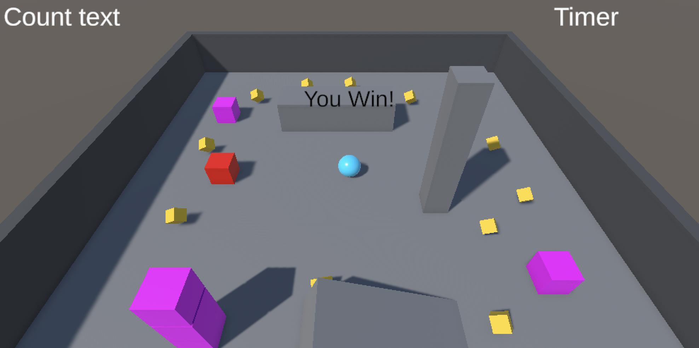

# Blog Post 1: Roll-a-ball

The first Unity task I worked on was the **Roll-a-ball** tutorial. This was a good introduction to Unity because it covered many of the basic things that are needed when making a game, such as GameObjects, components, physics, input, cameras, UI, and simple scripts. The goal is for the player to control a ball, collects pickups, and try to win by collecting enough of them.

In the scene, I had a ground plane, walls around the level, pickups placed around the map, dynamic boxes, an enemy, a player, a camera, and a canvas for UI. Even though the game itself is small, it helped me understand how Unity scenes are built from multiple objects that each have their own purpose. For example, the player object had a Rigidbody so it could move with physics, the pickups had colliders so they could be collected, and the canvas displayed information like the count and timer.

Most of the player logic was handled in the `PlayerController` script. I used Unity’s Input System to read the movement input in `OnMove`, where the input value is converted into a `Vector2`. The script stores the X and Y movement values and then uses them to move the player.
The script was also handling updating the text on the scene and handling collision events.

The camera was handled with a simple `CameraController` script. At the start of the game, it calculates the offset between the camera and the player. In `LateUpdate`, it then follows the player by adding that offset to the player’s current position. This was a simple but useful way to learn how camera-follow behavior can be implemented in Unity.

There was also an enemy movement script. The enemy used a `NavMeshAgent` and followed the player when the game had started. The enemy needed a reference to the player and checked whether the player controller had started the game before moving.

This was a good introduction to Unity and what can I expect from the course. Even though the task wasn't that big, it gave me a good overview of the tools that I can use. This small task already covered a lot of topics, so I felt confident in preparing for my semester project.

A small note after finishing the semester project: Looking back I am happy that this task also covered the "AI behavior", since my project didn't really cover enemy AI behavior, due to it being a 1v1 local fighting game.
