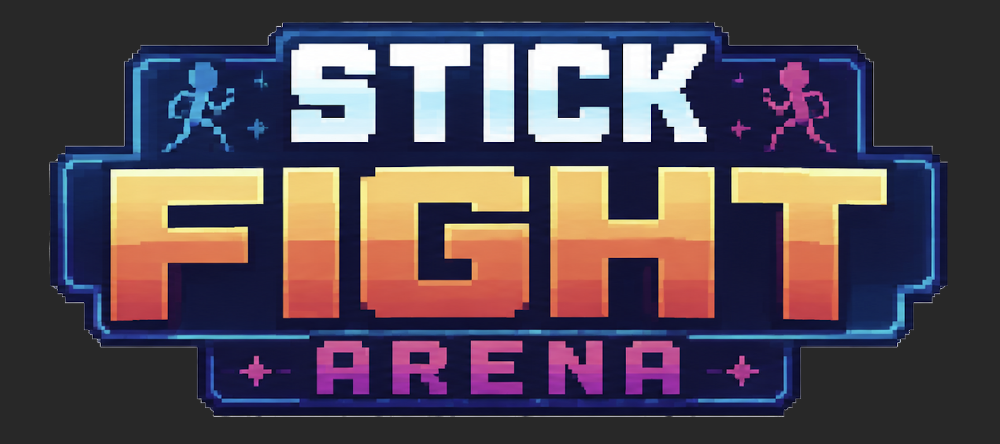
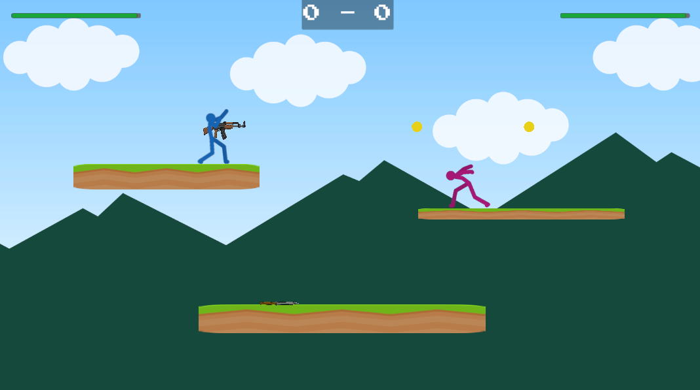

# Blog Post 2: Game Design Document & Milestones

## Game Design Document v1.0

The working title for my game is **Stick Fight Arena**. It is a local 2D fighting/platform game inspired by games like _Stick Fight_, _Super Smash Bros_ and _Brawlhalla_. The concept is simple: two players fight in a small arena using movement, attacks, and weapons that spawn during the round. The goal is to either reduce the opponent’s health to zero or knock them out of the arena. The game is made for two local players on the same screen.

The main gameplay loop is based on short rounds. Both players spawn in an arena, a “Ready/Fight” countdown starts, and then the players fight until one of them dies. During the round, weapons randomly spawn on the map, encouraging players to move around instead of standing still. When one player wins, the score is updated and a new round begins. The match can be played endlessly or as a “first to X wins” mode.

The main mechanics are movement, combat, physics, weapons, health, and round management. Player movement includes running, jumping, double jumping, dashing, wall sliding, and ledge climbing. Combat includes basic melee attacks, weapon attacks, gun shooting, damage, knockback, and death.

The visual style is simple and arcade-like. The characters are stickmen, and the arenas are small platform levels with colorful 2D backgrounds. The game does not need a deep story, because the focus is on fast local multiplayer gameplay. The audio style should support the arcade feeling, with sounds for jumping, dashing, weapon attacks, gunshots, damage, round wins, and menu navigation.

## Project Milestones

### Milestone 1: Core Playable Prototype

The first milestone is to create the basic playable version of the game. This includes two players, movement, jumping, attacking, health, damage, knockback, death, score tracking, and round reset logic. The goal is to make the core gameplay loop work before focusing on polish.

### Milestone 2: Weapons, Arenas and Game Feel

The second milestone is to make the game feel more complete. This includes random weapon spawning, weapon pickups, a melee weapon, a gun, projectiles, multiple arenas, better backgrounds, animations, and sound effects. The goal is to make the game feel less like a prototype and more like a real arcade game.

### Milestone 3: UI, Match Flow and Build

The final milestone is to finish the player experience around the gameplay. This includes a main menu, settings screen, match length options and pause menu. I will also focus on any bug fixes that would be found through testing.
