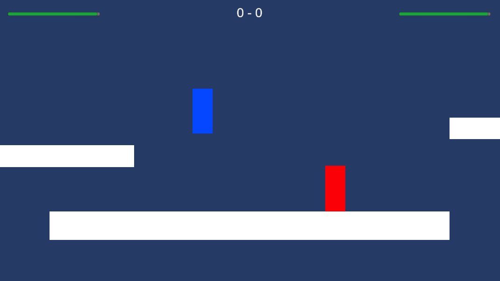
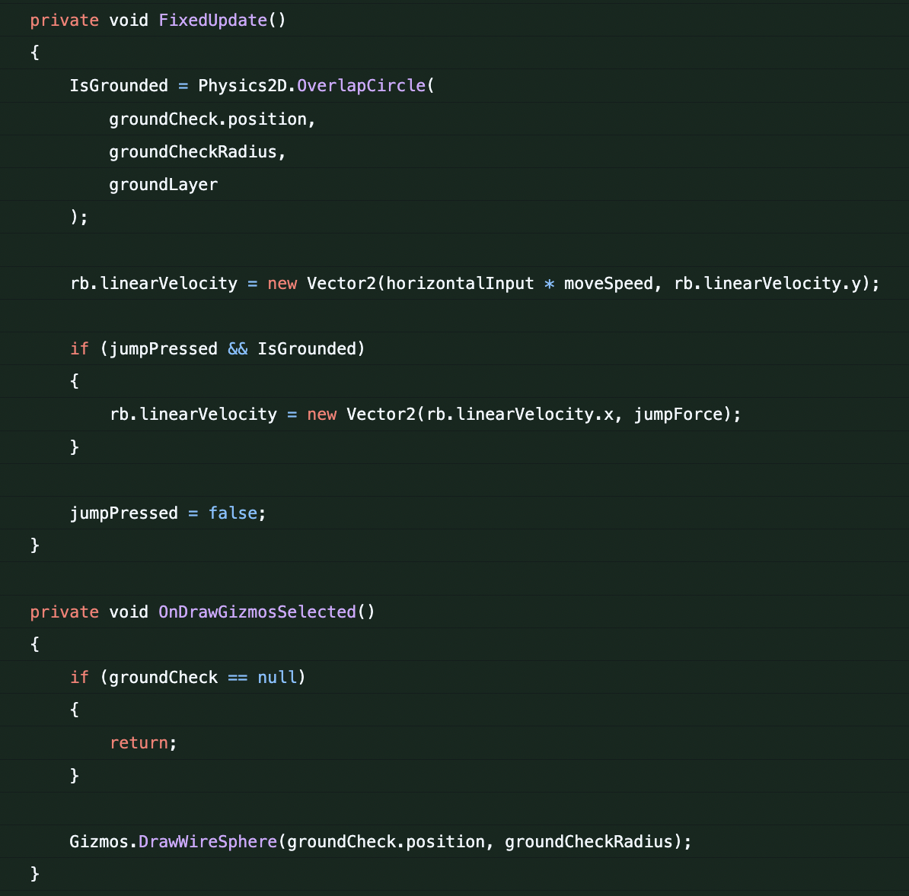
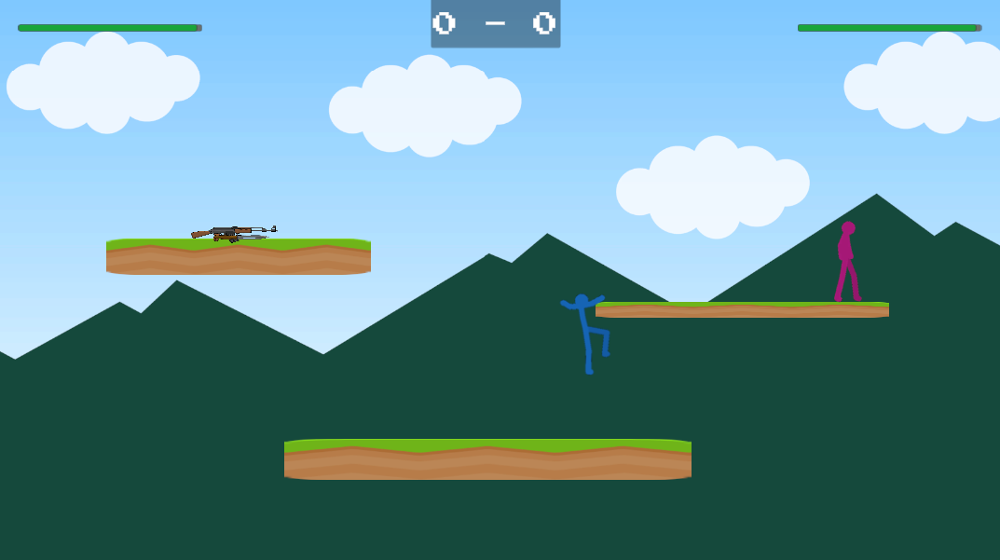
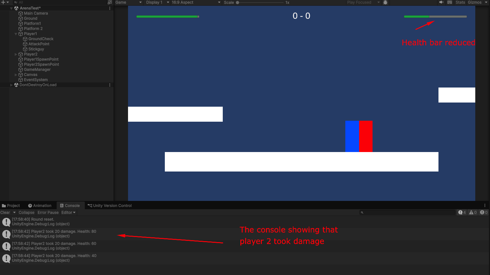
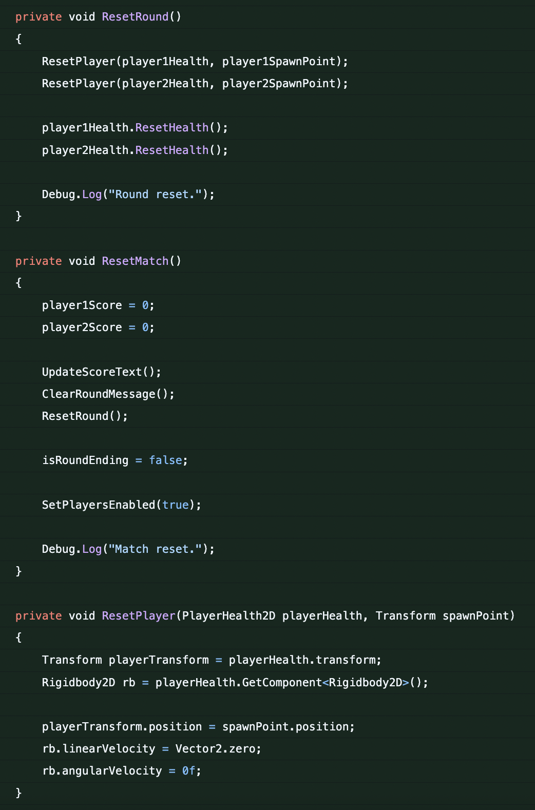

# Blog Post 3: Milestone 1 - Core Playable Prototype

The first milestone for **Stick Fight Arena** was to get the core playable prototype working. The goal was to see if the main idea actually worked. The most important thing was that two players could move around, fight each other, take damage, die, and restart the round.

I started by setting up a test arena with a few platforms and two player objects. In the beginning, the characters were still very simple. Each player got a `Rigidbody2D`, colliders, ground checks, and a movement script. The movement system was implemented in `PlayerMovement2D`, where I handled horizontal movement, jumping, double jumping, dashing, wall sliding, and ledge climbing.

One of the first tasks was making the movement feel responsive without becoming too chaotic. The players needed to move fast enough for the game to feel like an arcade fighting game, but not so fast that it became impossible to control. I also had to work with Unity physics, especially when combining jumping, dashing, gravity, and collisions with platforms. A lot of the work in this part was adjusting values like movement speed, jump force, dash speed, dash cooldown, and wall slide speed.

Another difficult part was the wall and ledge logic. At one point, the player could get stuck in a falling animation when only a small part of the body touched the side of a platform.

The ledge climb could also trigger in situations where the player was just sliding against a wall. To fix this, I adjusted the `wallCheck`, `ledgeCheck`, and the conditions for when wall sliding and ledge climbing were allowed.

After movement, I added the first combat system. The `PlayerMeleeAttack2D` script uses an attack point and checks for nearby players with `Physics2D.OverlapCircleAll`. If the opponent is inside the attack range, the script finds their `PlayerHealth2D` component and applies damage and knockback.

The health system was handled in `PlayerHealth2D`. Each player has max health, current health, and a death event. When health reaches zero, the player dies and the `RoundManager2D` reacts to it. I also added a fall death zone under the level, so players can lose by falling out of the arena.

The round manager became one of the most important scripts in the prototype. It keeps track of player scores, resets the players after a round, stops movement during transitions, and starts the next round.

By the end of this milestone, the game had a complete basic gameplay loop: two players spawn, they fight, one player dies, the score updates, and the round restarts.
