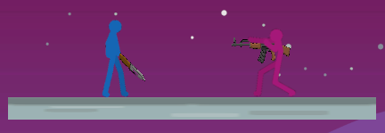
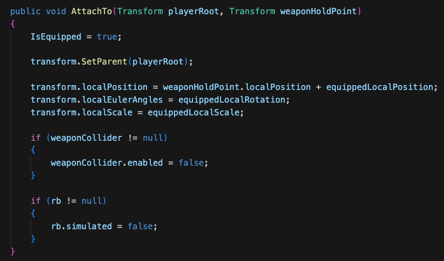
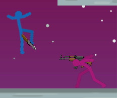
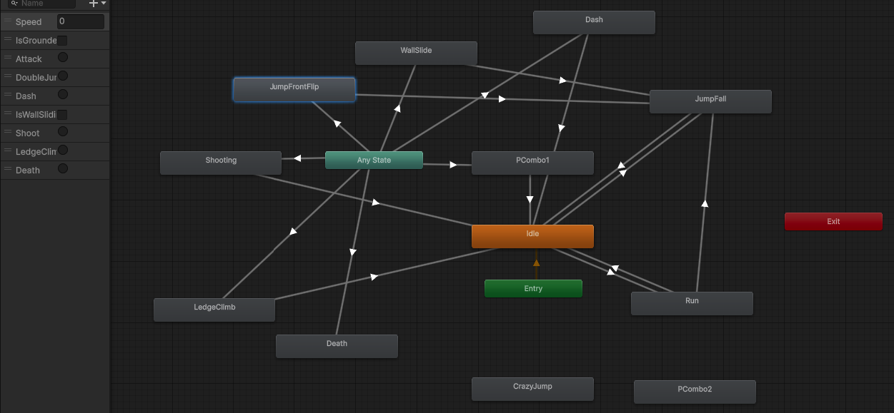
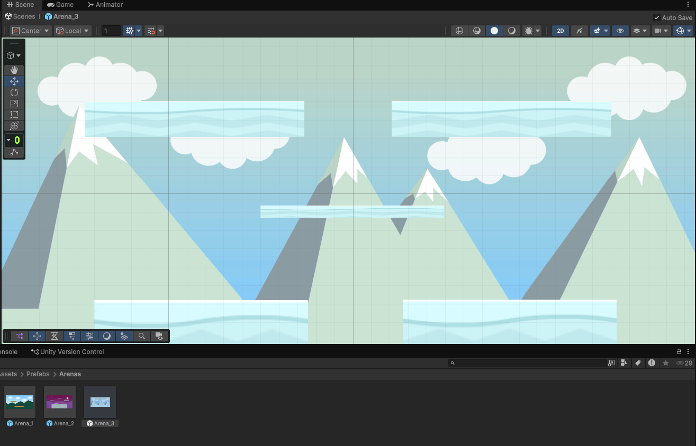

# Blog Post 4: Milestone 2 - Weapons, Arenas and Game Feel

The second milestone was about making **Stick Fight Arena** feel less like a prototype and more like an actual game. After the core movement, combat, health, and round loop worked, the next step was to add more gameplay variety and polish. The biggest parts of this milestone were weapons, arenas, animations, backgrounds, and sound effects.

The first major feature was the weapon system. I added a `WeaponPickup2D` script that stores weapon information such as weapon type, damage, attack range, knockback force, attack cooldown, projectile prefab, and projectile speed. This made it possible to use the same general system for both melee weapons and guns. When a player touches a weapon, it gets attached to a weapon hold point on the player, and the weapon collider is disabled so it no longer behaves like a pickup.

One problem I had was that the weapons looked fine on the ground, but looked wrong when picked up. The knife and gun were not aligned well with the player, and during attacks they did not follow the hands properly. I fixed this by adjusting equipped local position, rotation, and scale values, and by adding a small weapon use animation. The positioning is still off during some animations, but that is partly because the character animations and weapon assets were not made for each other.

I also worked more with animations during this milestone. The stickman asset had many animation clips, so I connected the most important ones in the Animator Controller, such as idle, running, jumping, falling, attacking, shooting, dashing, wall sliding, ledge climbing, and death. Some animations were controlled by movement values, while others were triggered directly from scripts. This made the players feel much more alive compared to the early prototype.

I also added multiple arenas and improved the visuals. The early prototype only had simple platforms and a plain background, but now each arena has a more finished 2D background. The arenas were made as prefabs, which are loaded depending on the current round.

Sound effects were another big part of this milestone. I added sounds for jumping, dashing, landing, weapon attacks, gunshots, damage, weapon pickup, round wins, and menu actions. Even small sounds made the game feel much more responsive.

There were also some bugs related to weapons between rounds. If a weapon spawned and nobody picked it up, it could stay visible when the next arena loaded. I fixed this by making sure the weapon spawner clears old spawned weapons when a new round is prepared.

By the end of this milestone, the game had weapons, random spawning, better arenas, backgrounds, animations, and sound.
