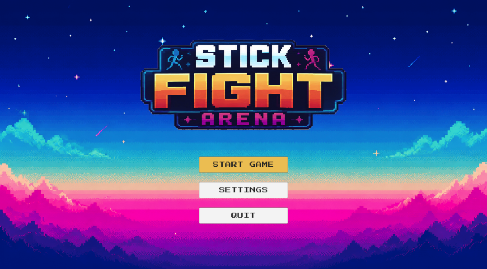
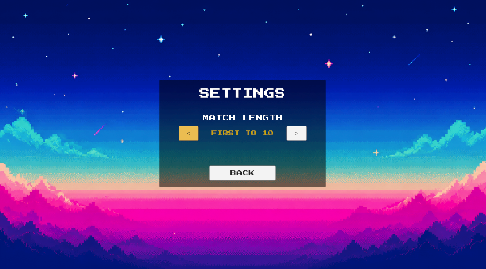
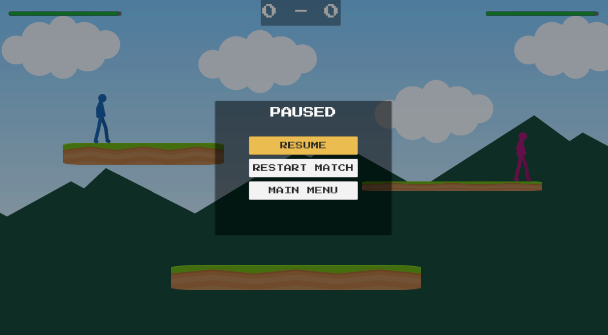

# Blog Post 5: Milestone 3 - UI and Match Flow

The third milestone was about finishing the player experience around the actual gameplay. At this point, the core game was working, but it still needed a proper menu flow, match settings, and a pause menu. This milestone was important because it made the project feel like a complete game instead of only a playable Unity scene.

The first step was creating the main menu. I wanted the menu to match the arcade style of the game, so I used a colorful 2D background, a custom logo, the `Press Start 2P` font, and simple button styling. The main menu includes three options: start game, settings, and quit. I also added menu sound effects for moving between buttons and selecting options, which made the UI feel more responsive.

The settings screen was added so the player can choose the match length. Instead of only having endless rounds, the game can now be played as endless mode, first to 1, first to 3, first to 5, or first to 10. This was implemented through `GameUIManager2D`, which updates the selected setting, changes the UI text, and sends the selected win target to `RoundManager2D`. The round manager then checks after each round if a player has reached the target score.

A bug appeared when testing “first to 1”. The match win message appeared correctly, but after a few seconds a new round started automatically. This happened because my round manager originally reset the match after the end delay. I changed the flow so that when a player wins the full match, an event is sent to the UI manager and the game returns to the main menu instead.

I also added a pause menu with resume, restart match, and main menu options. Pressing Escape opens and closes the pause menu by using `Time.timeScale = 0`. One issue was that the characters could still rotate while the game was paused, and jump input could be stored and triggered after unpausing. I fixed this by making the player movement and attack scripts ignore input while `Time.timeScale` is zero.

By the end of this milestone, the game had a full menu flow, match settings, and a pause menu. This made the project feel more complete and made it easier to play the game as an actual match instead of just restarting rounds manually.
