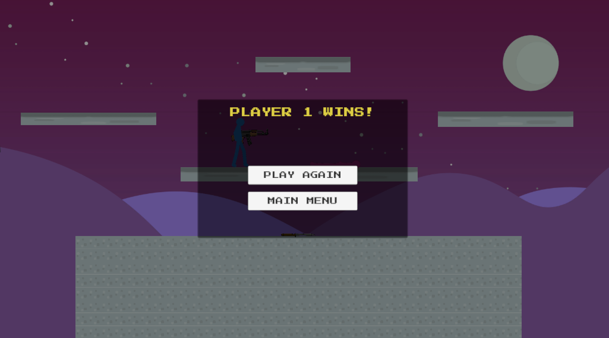

# Blog Post 6: Final Showcase and Conclusion

The final version of **Stick Fight Arena** is a local 2D fighting/platform game where two players fight in small arenas using movement, attacks, and randomly spawning weapons. It has a full gameplay loop, several arenas, weapons, animations, sound effects, menus, match settings, and a victory screen.

The core gameplay is based on short rounds. Both players spawn into an arena, wait for the “Ready/Fight” countdown, and then try to defeat each other. A player can win a round by reducing the opponent’s health to zero or by knocking them out of the arena. After each round, the score is updated and the next round starts. The game also supports different match lengths, such as endless mode or “first to 1”, “first to 3”, “first to 5”, and “first to 10”.

The final game includes movement mechanics such as running, jumping, double jumping, dashing, wall sliding, and ledge climbing. These mechanics make the fights more active and give players more ways to recover or escape. The combat system includes basic melee attacks, a knife, a gun, projectiles, damage, knockback, health, and death logic.
Weapons spawn during the round, which encourages players to move around instead of staying in one place.

The UI is very simple but it connects the overall game concept all together. The game has a main menu, settings screen, pause menu, score display, health bars, round messages, and a victory screen.

Overall, I am happy with the final result. The game is not perfect, and some things could still be improved, such as better weapon alignment during certain animations, more weapons, more arenas, and more balancing. I am a big fighting game fan and would have liked to include some combos or special moves, but still I am very happy with this result.

This project helped me work with many parts of Unity, like scripting, physics, animation, UI, audio, prefabs, Web builds, and game architecture. The hardest part was not one single feature, but making all the systems work together without breaking the round and match flow. In the end, **Stick Fight Arena** became a complete small arcade fighting game, which was the main goal of the project.
